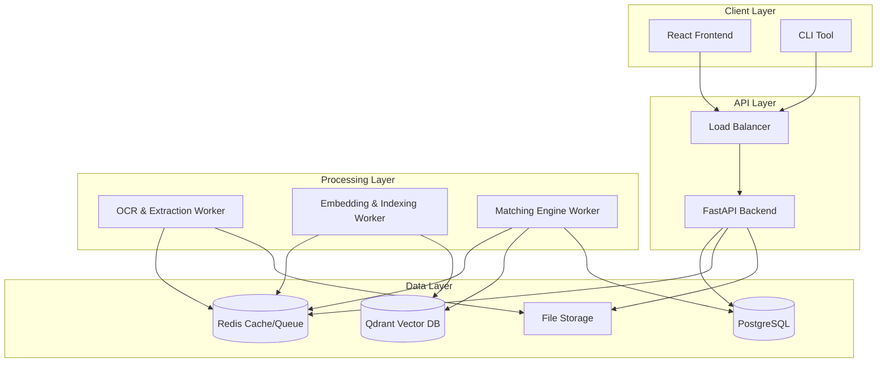

# PlagiaScan System Architecture

## Overview
PlagiaScan is designed as a modular, microservices-ready system. It separates the interactive REST API from the compute-intensive processing workers to ensure scalability and responsiveness.

## High-Level Architecture

## Components

### 1. Frontend (Client)
- **Tech:** React, Tailwind CSS, Vite.
- **Role:** User interface for uploading documents, viewing reports, and admin management.
- **Interaction:** Communicates with Backend via REST API.

### 2. Backend API
- **Tech:** Python, FastAPI, Uvicorn.
- **Role:** 
    - Handles Authentication & Authorization.
    - Manages file uploads and storage.
    - Enqueues processing tasks.
    - Serves analysis reports.
- **Scalability:** Stateless, can be horizontally scaled behind a load balancer.

### 3. Message Queue & Cache
- **Tech:** Redis.
- **Role:**
    - **Queue:** Celery broker for distributing tasks (OCR, Embedding, Matching).
    - **Cache:** Stores session data, progress status, and frequent query results.

### 4. Processing Workers
- **Tech:** Python, Celery / FastStream.
- **Pipelines:**
    - **Ingestion:** File -> Text Extraction -> Cleaning -> Normalization.
    - **Indexing:** Text -> Chunking -> Embedding (Sentence-Transformers) -> Qdrant Upsert.
    - **Detection:** Query Document -> Embedding -> Vector Search + Lexical Search -> Score Fusion -> Report Generation.

### 5. Storage
- **PostgreSQL:** Stores relational data (Users, Document Metadata, Scan Results, Audit Logs).
- **Qdrant:** Stores high-dimensional vector embeddings for semantic search.
- **File Storage:** Local filesystem (MVP) or S3-compatible storage (Production) for raw files.

## Data Flow

### Document Upload & Indexing
1. User uploads file via API.
2. API saves file to Storage and creates record in Postgres.
3. API pushes `process_document` task to Redis.
4. **Worker** picks up task:
    - Extracts text (OCR if needed).
    - Cleans and normalizes text.
    - Splits text into chunks.
    - Generates embeddings for each chunk.
    - Upserts chunks + embeddings to Qdrant.
    - Updates document status in Postgres.

### Plagiarism Scan
1. User requests scan for a document.
2. API pushes `scan_document` task to Redis.
3. **Worker** picks up task:
    - Retrieves document chunks from Qdrant/Storage.
    - **Semantic Search:** Queries Qdrant for similar vectors.
    - **Lexical Search:** Uses MinHash/Inverted Index for exact/fuzzy matches.
    - **Fusion:** Combines scores using weighted average.
    - **Reporting:** Generates detailed match report with highlighting.
    - Saves report to Postgres.
4. User polls/receives notification of completion.
